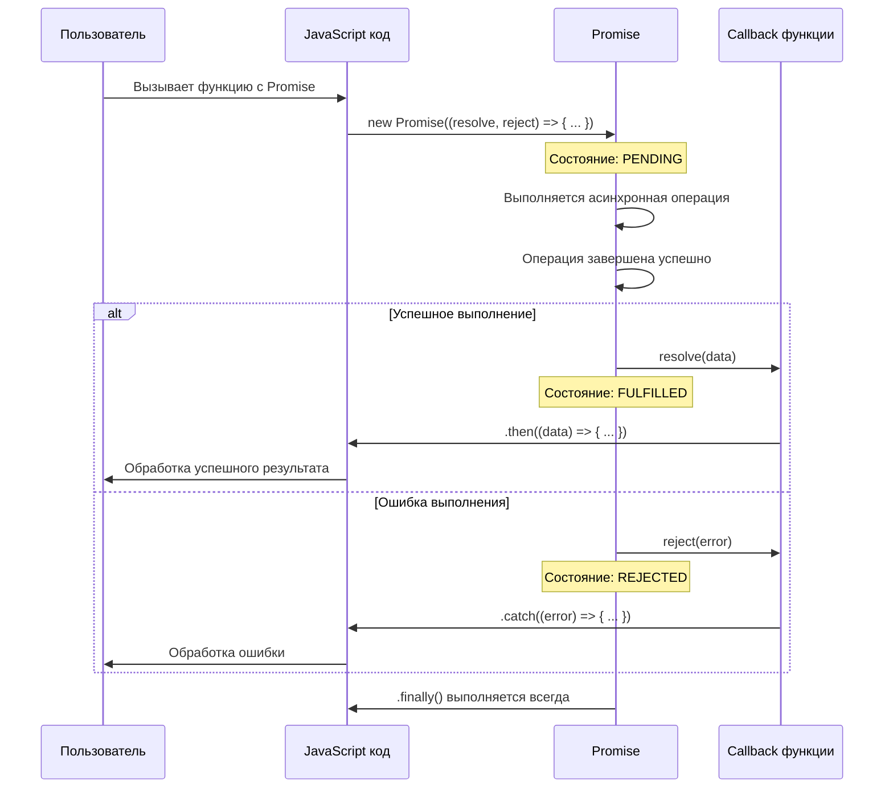
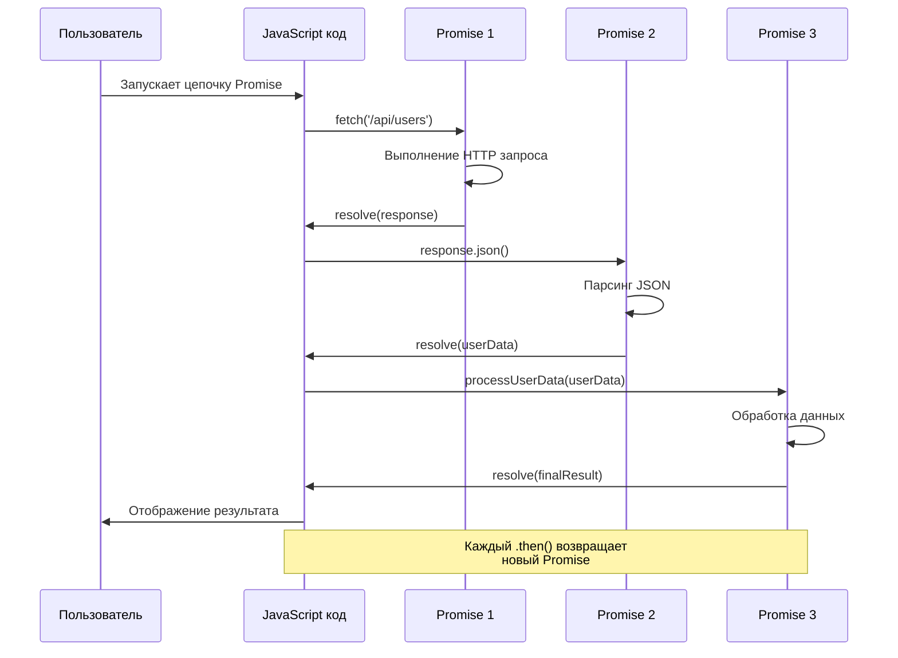
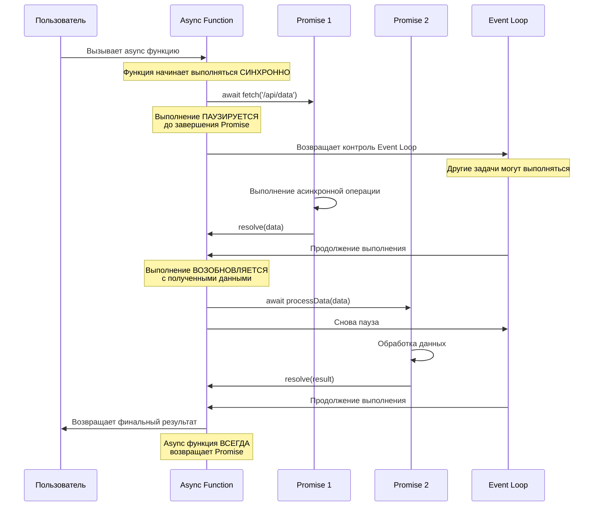
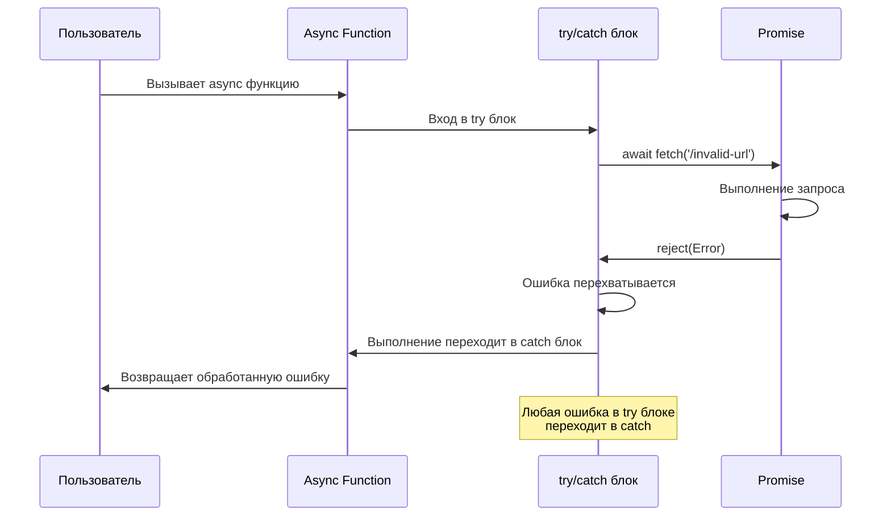
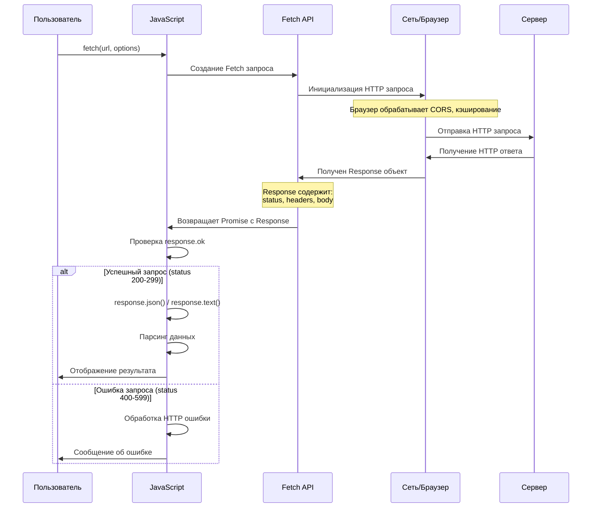
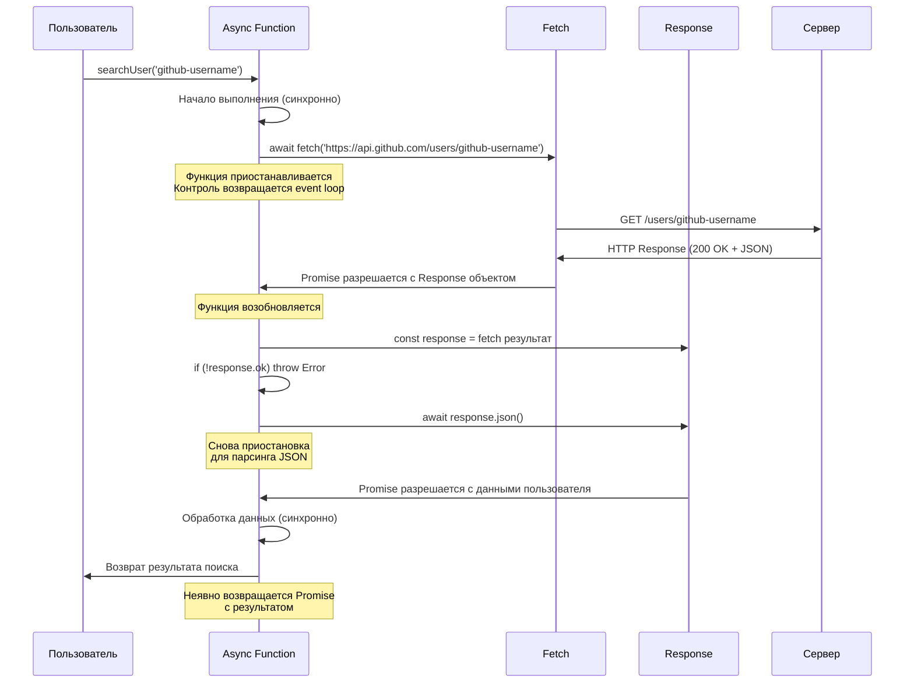
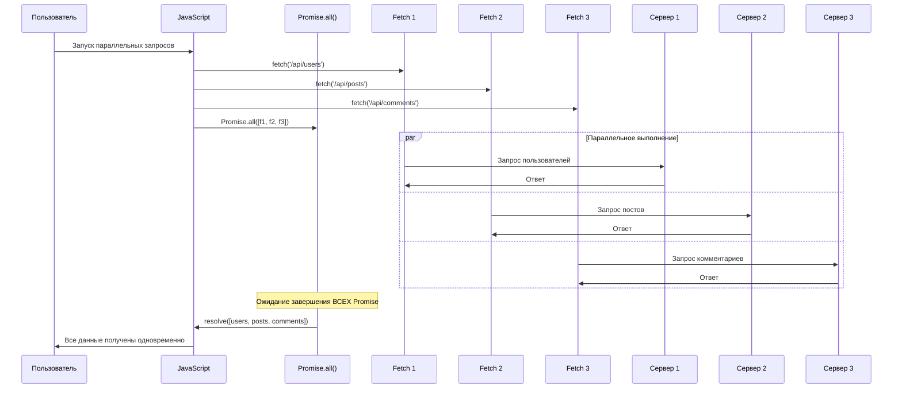
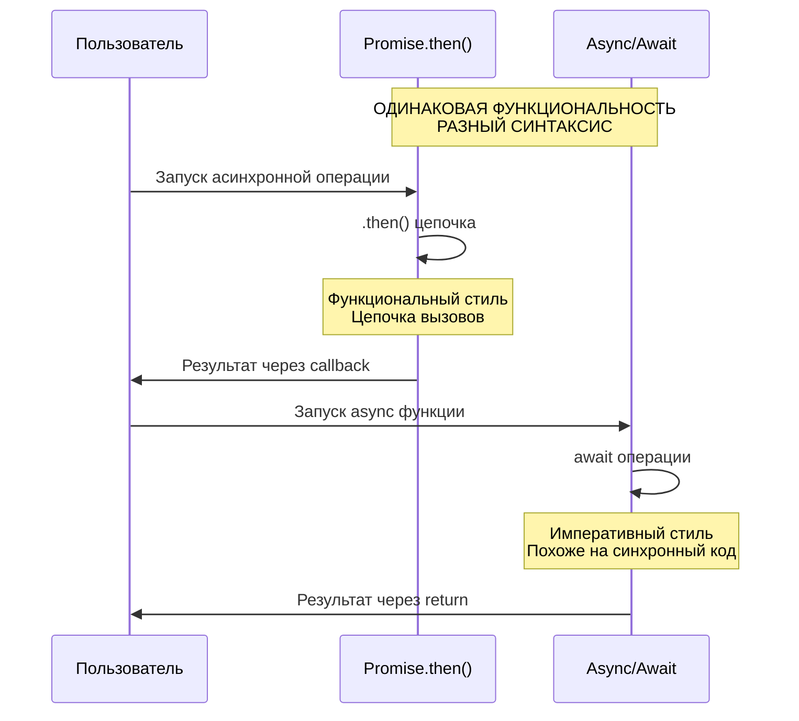

# Диаграммы последовательностей для Promise, async/await, Fetch API

## 1. Диаграмма работы Promise



## 2. Диаграмма цепочки Promise (Promise Chaining)



## 3. Диаграмма работы async/await



## 4. Диаграмма обработки ошибок в async/await



## 5. Диаграмма работы Fetch API



## 6. Полная диаграмма: async/await + Fetch API



## 7. Диаграмма параллельных запросов с Promise.all()



## 8. Диаграмма сравнения Promise.then() vs async/await



## Ключевые выводы из диаграмм:

### 🔄 **Event Loop и паузы:**
- async/await не блокирует главный поток
- При await выполнение приостанавливается, но event loop работает
- Другие задачи могут выполняться во время ожидания

### ⛓ **Цепочки vs последовательности:**
- Promise.then() создает цепочки вызовов
- async/await выглядит как последовательный код
- Под капотом работают одинаково

### 🚀 **Параллелизм:**
- Promise.all() для параллельного выполнения
- Последовательные await для зависимых операций
- Выбор зависит от требований к данным

### 🛡 **Обработка ошибок:**
- Promise: .catch() в конце цепочки
- async/await: try/catch как в синхронном коде
- Оба подхода одинаково мощные


# Практика: Promise, async/await, Fetch API

## 📚 Упражнение 1: Понимание Promise

### Задача:
Создаем свои промисы для понимания их работы.

```html
<!DOCTYPE html>
<html>
<head>
    <title>Promise Practice</title>
    <style>
        .container { max-width: 800px; margin: 0 auto; padding: 20px; }
        .button { padding: 10px 20px; margin: 5px; border: none; border-radius: 5px; cursor: pointer; }
        .success { background-color: #4CAF50; color: white; }
        .error { background-color: #f44336; color: white; }
        .info { background-color: #2196F3; color: white; }
        .log { margin-top: 20px; padding: 15px; background: #f5f5f5; border-radius: 5px; }
        .log-entry { margin: 5px 0; padding: 5px; border-left: 3px solid #ccc; }
    </style>
</head>
<body>
    <div class="container">
        <h1>🔮 Практика с Promise</h1>
        
        <button class="button success" id="successBtn">Успешный Promise</button>
        <button class="button error" id="errorBtn">Promise с ошибкой</button>
        <button class="button info" id="sequenceBtn">Цепочка Promise</button>
        
        <div class="log" id="log"></div>
    </div>

    <script>
        const log = document.getElementById('log');
        
        function addLog(message, type = 'info') {
            const entry = document.createElement('div');
            entry.className = 'log-entry';
            entry.style.borderLeftColor = type === 'error' ? '#f44336' : 
                                        type === 'success' ? '#4CAF50' : '#2196F3';
            entry.textContent = `[${new Date().toLocaleTimeString()}] ${message}`;
            log.appendChild(entry);
            log.scrollTop = log.scrollHeight;
        }

        // 📌 1. СОЗДАНИЕ ПРОСТОГО PROMISE
        function createSuccessPromise() {
            addLog('🔹 Создаем успешный Promise...');
            
            /* 
            КОНСТРУКТОР PROMISE:
            - Принимает функцию-исполнитель (executor)
            - Executor получает два параметра: resolve и reject
            - resolve() - успешное завершение
            - reject() - завершение с ошибкой
            */
            return new Promise((resolve, reject) => {
                addLog('Promise начал выполнение...');
                
                // Имитируем асинхронную операцию (загрузка, запрос и т.д.)
                setTimeout(() => {
                    const result = 'Данные успешно загружены! ✅';
                    addLog('Promise завершил работу');
                    resolve(result); // Успешное завершение
                }, 2000);
            });
        }

        // 📌 2. PROMISE С ОШИБКОЙ
        function createErrorPromise() {
            addLog('🔹 Создаем Promise с ошибкой...');
            
            return new Promise((resolve, reject) => {
                setTimeout(() => {
                    const error = new Error('Ошибка загрузки! ❌');
                    addLog('Promise завершился с ошибкой');
                    reject(error); // Завершение с ошибкой
                }, 2000);
            });
        }

        // 📌 3. ОБРАБОТКА PROMISE С ПОМОЩЬЮ .then() .catch()
        document.getElementById('successBtn').addEventListener('click', function() {
            addLog('--- ЗАПУСК УСПЕШНОГО PROMISE ---');
            
            createSuccessPromise()
                .then(result => {
                    /* 
                    .then() выполняется когда Promise успешно завершен (resolve)
                    - Получает результат из resolve()
                    */
                    addLog(`✅ then: ${result}`, 'success');
                })
                .catch(error => {
                    /*
                    .catch() выполняется когда Promise завершен с ошибкой (reject)
                    - Получает ошибку из reject()
                    */
                    addLog(`❌ catch: ${error.message}`, 'error');
                })
                .finally(() => {
                    /*
                    .finally() выполняется ВСЕГДА, независимо от результата
                    - Используется для cleanup операций
                    */
                    addLog('🏁 finally: Операция завершена (успех или ошибка)');
                });
        });

        document.getElementById('errorBtn').addEventListener('click', function() {
            addLog('--- ЗАПУСК PROMISE С ОШИБКОЙ ---');
            
            createErrorPromise()
                .then(result => {
                    addLog(`✅ then: ${result}`, 'success');
                })
                .catch(error => {
                    addLog(`❌ catch: ${error.message}`, 'error');
                })
                .finally(() => {
                    addLog('🏁 finally: Операция завершена (успех или ошибка)');
                });
        });

        // 📌 4. ЦЕПОЧКА PROMISE (CHAINING)
        document.getElementById('sequenceBtn').addEventListener('click', function() {
            addLog('--- ЗАПУСК ЦЕПОЧКИ PROMISE ---');
            
            // Первый Promise
            new Promise((resolve, reject) => {
                setTimeout(() => {
                    addLog('🔹 Шаг 1: Получаем userId...');
                    resolve(123); // Возвращаем userId
                }, 1000);
            })
            .then(userId => {
                /* 
                ЦЕПОЧКА .then():
                - Каждый .then() получает результат предыдущего
                - Можно возвращать новые значения или новые Promise
                */
                addLog(`🔹 Шаг 2: Получили userId = ${userId}, запрашиваем данные пользователя...`);
                return new Promise(resolve => {
                    setTimeout(() => {
                        resolve({ userId, name: 'Иван Иванов', email: 'ivan@example.com' });
                    }, 1000);
                });
            })
            .then(userData => {
                addLog(`🔹 Шаг 3: Получили данные пользователя: ${userData.name}`);
                addLog(`🔹 Шаг 4: Запрашиваем заказы пользователя...`);
                return new Promise(resolve => {
                    setTimeout(() => {
                        resolve({
                            ...userData,
                            orders: ['Заказ #1', 'Заказ #2', 'Заказ #3']
                        });
                    }, 1000);
                });
            })
            .then(finalData => {
                addLog(`✅ Финальный результат:`, 'success');
                addLog(`   Пользователь: ${finalData.name}`);
                addLog(`   Email: ${finalData.email}`);
                addLog(`   Заказы: ${finalData.orders.join(', ')}`);
            })
            .catch(error => {
                addLog(`❌ Ошибка в цепочке: ${error.message}`, 'error');
            });
        });
    </script>
</body>
</html>
```

---

## 📚 Упражнение 2: async/await

### Задача:
Переписываем промисы на async/await для более читаемого кода.

```html
<!DOCTYPE html>
<html>
<head>
    <title>Async/Await Practice</title>
    <style>
        .user-card { 
            border: 1px solid #ddd; 
            padding: 15px; 
            margin: 10px 0; 
            border-radius: 8px; 
            background: white;
        }
        .loading { opacity: 0.6; }
        .error { border-color: #f44336; background: #ffebee; }
    </style>
</head>
<body>
    <div class="container">
        <h1>⏳ Практика с async/await</h1>
        
        <button class="button success" id="loadUserBtn">Загрузить пользователя</button>
        <button class="button info" id="parallelBtn">Параллельные запросы</button>
        <button class="button error" id="errorHandlingBtn">Обработка ошибок</button>
        
        <div id="userContainer"></div>
        <div class="log" id="log2"></div>
    </div>

    <script>
        const userContainer = document.getElementById('userContainer');
        const log2 = document.getElementById('log2');

        function addLog2(message, type = 'info') {
            const entry = document.createElement('div');
            entry.className = 'log-entry';
            entry.style.borderLeftColor = type === 'error' ? '#f44336' : 
                                        type === 'success' ? '#4CAF50' : '#2196F3';
            entry.textContent = `[${new Date().toLocaleTimeString()}] ${message}`;
            log2.appendChild(entry);
        }

        // 📌 ИМИТАЦИЯ API-ЗАПРОСОВ
        function fakeApiRequest(data, delay = 1000, shouldFail = false) {
            return new Promise((resolve, reject) => {
                setTimeout(() => {
                    if (shouldFail) {
                        reject(new Error(`Ошибка загрузки: ${data}`));
                    } else {
                        resolve({ data, timestamp: new Date().toLocaleTimeString() });
                    }
                }, delay);
            });
        }

        // 📌 1. БАЗОВОЕ ИСПОЛЬЗОВАНИЕ async/await
        document.getElementById('loadUserBtn').addEventListener('click', async function() {
            addLog2('--- ЗАГРУЗКА ПОЛЬЗОВАТЕЛЯ (async/await) ---');
            
            try {
                // 🔹 async функция ВСЕГДА возвращает Promise
                // 🔹 await можно использовать ТОЛЬКО внутри async функций
                
                addLog2('1. Начинаем загрузку пользователя...');
                
                // await "останавливает" выполнение до завершения Promise
                const user = await fakeApiRequest('Данные пользователя', 1500);
                addLog2(`2. Пользователь загружен: ${user.data}`, 'success');
                
                addLog2('3. Загружаем профиль...');
                const profile = await fakeApiRequest('Профиль пользователя', 1000);
                addLog2(`4. Профиль загружен: ${profile.data}`, 'success');
                
                addLog2('5. Загружаем настройки...');
                const settings = await fakeApiRequest('Настройки', 800);
                addLog2(`6. Настройки загружены: ${settings.data}`, 'success');
                
                // Отображаем результат
                userContainer.innerHTML = `
                    <div class="user-card">
                        <h3>✅ Данные успешно загружены!</h3>
                        <p>Пользователь: ${user.data}</p>
                        <p>Профиль: ${profile.data}</p>
                        <p>Настройки: ${settings.data}</p>
                        <p>Время: ${user.timestamp}</p>
                    </div>
                `;
                
            } catch (error) {
                addLog2(`❌ Ошибка: ${error.message}`, 'error');
                userContainer.innerHTML = `
                    <div class="user-card error">
                        <h3>❌ Ошибка загрузки</h3>
                        <p>${error.message}</p>
                    </div>
                `;
            }
        });

        // 📌 2. ПАРАЛЛЕЛЬНОЕ ВЫПОЛНЕНИЕ С Promise.all()
        document.getElementById('parallelBtn').addEventListener('click', async function() {
            addLog2('--- ПАРАЛЛЕЛЬНАЯ ЗАГРУЗКА ---');
            
            try {
                addLog2('Запускаем 3 параллельных запроса...');
                
                // 🔹 Promise.all() ждет завершения ВСЕХ промисов
                // 🔹 Запросы выполняются параллельно (экономит время)
                const [users, products, orders] = await Promise.all([
                    fakeApiRequest('Список пользователей', 2000),
                    fakeApiRequest('Каталог товаров', 1500),
                    fakeApiRequest('История заказов', 1800)
                ]);
                
                addLog2('✅ Все запросы завершены!', 'success');
                addLog2(`• ${users.data} (${users.timestamp})`);
                addLog2(`• ${products.data} (${products.timestamp})`);
                addLog2(`• ${orders.data} (${orders.timestamp})`);
                
            } catch (error) {
                addLog2(`❌ Один из запросов завершился ошибкой: ${error.message}`, 'error');
            }
        });

        // 📌 3. ОБРАБОТКА ОШИБОК В async/await
        document.getElementById('errorHandlingBtn').addEventListener('click', async function() {
            addLog2('--- ОБРАБОТКА ОШИБОК ---');
            
            try {
                addLog2('1. Запрос, который завершится успешно...');
                const successData = await fakeApiRequest('Успешные данные', 1000);
                addLog2(`✅ ${successData.data}`, 'success');
                
                addLog2('2. Запрос, который ЗАВЕРШИТСЯ ОШИБКОЙ...');
                const failedData = await fakeApiRequest('Проблемные данные', 1000, true);
                // Эта строка не выполнится из-за ошибки выше
                addLog2('Этого сообщения вы не увидите...');
                
            } catch (error) {
                /* 
                🔹 БЛОК catch перехватывает ЛЮБУЮ ошибку в try блоке
                🔹 Ошибка может быть из await или обычная синхронная
                */
                addLog2(`❌ Перехвачена ошибка: ${error.message}`, 'error');
                
                // Можно продолжить выполнение после ошибки
                addLog2('3. Продолжаем работу после ошибки...');
                const recoveryData = await fakeApiRequest('Восстановленные данные', 800);
                addLog2(`✅ Восстановление: ${recoveryData.data}`, 'success');
            } finally {
                // 🔹 finally выполняется ВСЕГДА
                addLog2('🏁 Блок finally: Завершение операции');
            }
        });
    </script>
</body>
</html>
```

---

## 📚 Упражнение 3: Fetch API

### Задача:
Работа с реальными API запросами.

```html
<!DOCTYPE html>
<html>
<head>
    <title>Fetch API Practice</title>
    <style>
        .post { border: 1px solid #ddd; margin: 10px 0; padding: 15px; border-radius: 5px; }
        .post h3 { margin-top: 0; color: #333; }
        .loading { text-align: center; padding: 20px; font-style: italic; color: #666; }
        .error { background: #ffebee; border-color: #f44336; }
    </style>
</head>
<body>
    <div class="container">
        <h1>🌐 Практика с Fetch API</h1>
        
        <div class="controls">
            <button class="button success" id="getPostsBtn">Получить посты</button>
            <button class="button info" id="getUserBtn">Получить пользователя</button>
            <button class="button error" id="invalidUrlBtn">Неверный URL (ошибка)</button>
            <button class="button" id="createPostBtn">Создать пост (POST)</button>
        </div>
        
        <div id="loading" class="loading" style="display: none;">⏳ Загрузка...</div>
        <div id="results"></div>
        <div class="log" id="log3"></div>
    </div>

    <script>
        const results = document.getElementById('results');
        const loading = document.getElementById('loading');
        const log3 = document.getElementById('log3');

        function addLog3(message, type = 'info') {
            const entry = document.createElement('div');
            entry.className = 'log-entry';
            entry.style.borderLeftColor = type === 'error' ? '#f44336' : 
                                        type === 'success' ? '#4CAF50' : '#2196F3';
            entry.textContent = `[${new Date().toLocaleTimeString()}] ${message}`;
            log3.appendChild(entry);
        }

        // 📌 1. БАЗОВЫЙ GET-ЗАПРОС С FETCH
        document.getElementById('getPostsBtn').addEventListener('click', async function() {
            addLog3('--- GET ЗАПРОС: Получение постов ---');
            loading.style.display = 'block';
            results.innerHTML = '';
            
            try {
                /* 
                🔹 fetch() ВСЕГДА возвращает Promise
                🔹 По умолчанию выполняется GET запрос
                🔹 Базовый URL: JSONPlaceholder (тестовое API)
                */
                addLog3('1. Отправляем GET запрос к API...');
                
                const response = await fetch('https://jsonplaceholder.typicode.com/posts?_limit=3');
                
                /* 
                🔹 Response object содержит:
                - status: HTTP статус код (200, 404, 500...)
                - ok: boolean (true если статус 200-299)
                - headers: метаданные ответа
                */
                addLog3(`2. Получен ответ: Status ${response.status}, OK: ${response.ok}`);
                
                if (!response.ok) {
                    // Если статус не в диапазоне 200-299
                    throw new Error(`HTTP error! status: ${response.status}`);
                }
                
                // 🔹 response.json() парсит JSON тело ответа
                const posts = await response.json();
                addLog3(`3. Данные распарсены, получено ${posts.length} постов`, 'success');
                
                // Отображаем результаты
                results.innerHTML = posts.map(post => `
                    <div class="post">
                        <h3>📝 ${post.title}</h3>
                        <p>${post.body}</p>
                        <small>ID: ${post.id}, UserID: ${post.userId}</small>
                    </div>
                `).join('');
                
            } catch (error) {
                addLog3(`❌ Ошибка: ${error.message}`, 'error');
                results.innerHTML = `<div class="post error">Ошибка: ${error.message}</div>`;
            } finally {
                loading.style.display = 'none';
            }
        });

        // 📌 2. GET ЗАПРОС С ПАРАМЕТРАМИ
        document.getElementById('getUserBtn').addEventListener('click', async function() {
            addLog3('--- GET ЗАПРОС: Получение пользователя ---');
            loading.style.display = 'block';
            results.innerHTML = '';
            
            try {
                const userId = Math.floor(Math.random() * 10) + 1; // Случайный ID 1-10
                addLog3(`1. Запрашиваем пользователя с ID: ${userId}`);
                
                const response = await fetch(`https://jsonplaceholder.typicode.com/users/${userId}`);
                
                if (!response.ok) {
                    throw new Error(`Пользователь не найден! Status: ${response.status}`);
                }
                
                const user = await response.json();
                addLog3(`2. Получен пользователь: ${user.name}`, 'success');
                
                results.innerHTML = `
                    <div class="post">
                        <h3>👤 ${user.name}</h3>
                        <p><strong>Email:</strong> ${user.email}</p>
                        <p><strong>Телефон:</strong> ${user.phone}</p>
                        <p><strong>Website:</strong> ${user.website}</p>
                        <p><strong>Компания:</strong> ${user.company.name}</p>
                        <p><strong>Город:</strong> ${user.address.city}</p>
                    </div>
                `;
                
            } catch (error) {
                addLog3(`❌ Ошибка: ${error.message}`, 'error');
                results.innerHTML = `<div class="post error">${error.message}</div>`;
            } finally {
                loading.style.display = 'none';
            }
        });

        // 📌 3. ОБРАБОТКА ОШИБОК СЕТИ
        document.getElementById('invalidUrlBtn').addEventListener('click', async function() {
            addLog3('--- ОШИБКА СЕТИ: Неверный URL ---');
            loading.style.display = 'block';
            results.innerHTML = '';
            
            try {
                // 🔹 Этот URL не существует - будет ошибка сети
                const response = await fetch('https://invalid-url-that-does-not-exist.com/data');
                const data = await response.json();
                
            } catch (error) {
                /* 
                🔹 Fetch выбрасывает ошибки для:
                - Проблем с сетью (нет интернета, неверный URL)
                - CORS ошибок
                - Но НЕ для HTTP ошибок (404, 500) - их нужно проверять вручную
                */
                addLog3(`❌ Сетевая ошибка: ${error.message}`, 'error');
                results.innerHTML = `
                    <div class="post error">
                        <h3>🌐 Сетевая ошибка</h3>
                        <p>${error.message}</p>
                        <p><small>Fetch не смог выполнить запрос к указанному URL</small></p>
                    </div>
                `;
            } finally {
                loading.style.display = 'none';
            }
        });

        // 📌 4. POST ЗАПРОС - ОТПРАВКА ДАННЫХ
        document.getElementById('createPostBtn').addEventListener('click', async function() {
            addLog3('--- POST ЗАПРОС: Создание поста ---');
            loading.style.display = 'block';
            results.innerHTML = '';
            
            try {
                const newPost = {
                    title: 'Новый пост с Fetch API',
                    body: 'Этот пост был создан с помощью JavaScript Fetch API',
                    userId: 1
                };
                
                addLog3('1. Подготавливаем данные для отправки...');
                
                const response = await fetch('https://jsonplaceholder.typicode.com/posts', {
                    method: 'POST', // 🔹 Указываем метод
                    headers: {
                        'Content-Type': 'application/json', // 🔹 Тип отправляемых данных
                    },
                    body: JSON.stringify(newPost) // 🔹 Преобразуем объект в JSON строку
                });
                
                addLog3(`2. POST запрос отправлен, статус: ${response.status}`);
                
                if (!response.ok) {
                    throw new Error(`Ошибка создания поста! Status: ${response.status}`);
                }
                
                const createdPost = await response.json();
                addLog3(`3. Пост создан! ID: ${createdPost.id}`, 'success');
                
                results.innerHTML = `
                    <div class="post">
                        <h3>✅ Пост успешно создан!</h3>
                        <p><strong>ID:</strong> ${createdPost.id}</p>
                        <p><strong>Заголовок:</strong> ${createdPost.title}</p>
                        <p><strong>Текст:</strong> ${createdPost.body}</p>
                        <p><strong>UserID:</strong> ${createdPost.userId}</p>
                        <p><em>Примечание: JSONPlaceholder не сохраняет данные, но имитирует успешный ответ</em></p>
                    </div>
                `;
                
            } catch (error) {
                addLog3(`❌ Ошибка: ${error.message}`, 'error');
                results.innerHTML = `<div class="post error">${error.message}</div>`;
            } finally {
                loading.style.display = 'none';
            }
        });
    </script>
</body>
</html>
```

---

## 🎯 Итоговое упражнение: Мини-приложение

### Задача:
Создаем приложение для поиска пользователей GitHub.

```html
<!DOCTYPE html>
<html>
<head>
    <title>GitHub User Search</title>
    <style>
        .search-container { margin: 20px 0; }
        .user-card { border: 1px solid #ddd; padding: 20px; margin: 10px 0; border-radius: 10px; }
        .avatar { width: 100px; height: 100px; border-radius: 50%; }
        .repo { display: inline-block; background: #f1f8ff; padding: 5px 10px; margin: 5px; border-radius: 3px; }
    </style>
</head>
<body>
    <div class="container">
        <h1>🔍 Поиск пользователей GitHub</h1>
        
        <div class="search-container">
            <input type="text" id="usernameInput" placeholder="Введите username GitHub...">
            <button id="searchBtn">Найти</button>
        </div>
        
        <div id="userInfo"></div>
        <div class="log" id="log4"></div>
    </div>

    <script>
        const usernameInput = document.getElementById('usernameInput');
        const searchBtn = document.getElementById('searchBtn');
        const userInfo = document.getElementById('userInfo');
        const log4 = document.getElementById('log4');

        function addLog4(message, type = 'info') {
            const entry = document.createElement('div');
            entry.className = 'log-entry';
            entry.style.borderLeftColor = type === 'error' ? '#f44336' : 
                                        type === 'success' ? '#4CAF50' : '#2196F3';
            entry.textContent = `[${new Date().toLocaleTimeString()}] ${message}`;
            log4.appendChild(entry);
        }

        // 📌 ФУНКЦИЯ ПОИСКА ПОЛЬЗОВАТЕЛЯ GITHUB
        async function searchGitHubUser(username) {
            if (!username.trim()) {
                throw new Error('Введите username для поиска');
            }

            addLog4(`🔍 Поиск пользователя: ${username}`);
            userInfo.innerHTML = '<div class="loading">⏳ Поиск пользователя...</div>';

            try {
                // 🔹 Запрос данных пользователя
                const userResponse = await fetch(`https://api.github.com/users/${username}`);
                
                if (!userResponse.ok) {
                    if (userResponse.status === 404) {
                        throw new Error('Пользователь не найден');
                    }
                    throw new Error(`Ошибка API: ${userResponse.status}`);
                }

                const userData = await userResponse.json();
                addLog4(`✅ Пользователь найден: ${userData.name || userData.login}`, 'success');

                // 🔹 Параллельный запрос репозиториев
                addLog4('📂 Загрузка репозиториев...');
                const reposResponse = await fetch(userData.repos_url);
                const reposData = await reposResponse.json();

                addLog4(`✅ Загружено репозиториев: ${reposData.length}`, 'success');

                // 🔹 Отображаем результат
                userInfo.innerHTML = `
                    <div class="user-card">
                        
                        <h2>${userData.name || userData.login}</h2>
                        <p>${userData.bio || 'Нет описания'}</p>
                        <p><strong>📍 Локация:</strong> ${userData.location || 'Не указана'}</p>
                        <p><strong>👥 Подписчики:</strong> ${userData.followers}</p>
                        <p><strong>📌 Репозитории:</strong> ${userData.public_repos}</p>
                        <p><strong>🔗 GitHub:</strong> <a href="${userData.html_url}" target="_blank">${userData.html_url}</a></p>
                        
                        <h3>📚 Последние репозитории:</h3>
                        ${reposData.slice(0, 5).map(repo => `
                            <div class="repo">
                                <a href="${repo.html_url}" target="_blank">${repo.name}</a>
                                <br>
                                <small>⭐ ${repo.stargazers_count} | 🍴 ${repo.forks_count}</small>
                            </div>
                        `).join('')}
                    </div>
                `;

            } catch (error) {
                addLog4(`❌ Ошибка: ${error.message}`, 'error');
                userInfo.innerHTML = `
                    <div class="user-card error">
                        <h3>❌ Ошибка поиска</h3>
                        <p>${error.message}</p>
                    </div>
                `;
            }
        }

        // 📌 ОБРАБОТЧИК ПОИСКА
        searchBtn.addEventListener('click', async function() {
            await searchGitHubUser(usernameInput.value);
        });

        // 📌 ПОИСК ПРИ НАЖАТИИ ENTER
        usernameInput.addEventListener('keypress', async function(event) {
            if (event.key === 'Enter') {
                await searchGitHubUser(usernameInput.value);
            }
        });

        addLog4('🚀 Приложение готово к работе! Введите username GitHub для поиска.');
    </script>
</body>
</html>
```

---

## 📝 Чек-лист понимания:

### ✅ Promise:

- [ ] Понимаю, что Promise может быть в состоянии pending/fulfilled/rejected
- [ ] Умею создавать свои Promise с new Promise()
- [ ] Понимаю разницу между resolve() и reject()
- [ ] Умею использовать .then(), .catch(), .finally()

### ✅ async/await:
- [ ] Понимаю, что async функция всегда возвращает Promise
- [ ] Умею использовать await для ожидания Promise
- [ ] Знаю, как обрабатывать ошибки с try/catch
- [ ] Понимаю разницу между последовательным и параллельным выполнением

### ✅ Fetch API:
- [ ] Умею делать GET и POST запросы
- [ ] Понимаю, как проверять response.ok
- [ ] Знаю, как обрабатывать сетевые ошибки
- [ ] Умею работать с заголовками и преобразовывать JSON

Теперь попробуйте выполнить все упражнения по порядку! 🚀